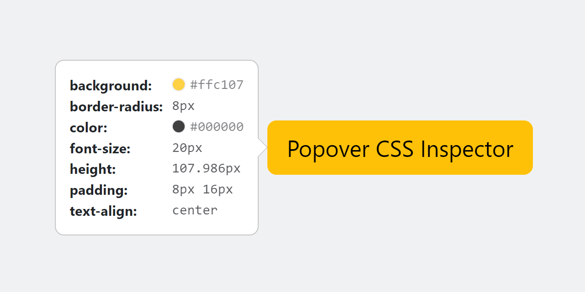

[](https://raw.githubusercontent.com/coliff/popover-css-inspector/main/LICENSE)
[](https://github.com/marketplace/actions/super-linter)
[](https://github.com/prettier/prettier)
[](https://www.npmjs.com/package/popover-css-inspector)
[](https://www.npmjs.com/package/popover-css-inspector)

# Popover CSS Inspector

Displays CSS attributes of elements in a Bootstrap popover. Ideal for design systems and style guides.

- Easy to use - just add `data-bs-custom-class="popover-css-inspector"` to the element (requires [Bootstrap 5 JavaScript](https://getbootstrap.com/docs/5.3/getting-started/introduction/#quick-start))
- Customizable with your own CSS and Bootstrap's [Popover options](https://getbootstrap.com/docs/5.3/components/popovers/#options)
- Popover remains static on the document and does not reposition on scroll
- Supports Bootstrap 5 dark mode
- [Option to hide CSS elements](#list-of-css-properties) - e.g. just add `data-css-inspector-hide="font-size"` to prevent font-size properties from displaying
- [Some CSS properties are hidden by default](#list-of-opt-in-css-properties) but can be enabled - e.g. just add `data-css-inspector-show="border"` to show border properties
- Reloads CSS attributes if the theme is changed via the `data-bs-theme` attribute - perfect for checking color value changes between light and dark mode
- Supports optional title with `data-bs-title` attribute.
- Only 3 KB minified and gzipped!



## Quick start

Several quick start options are available:

- [Download the latest release](https://github.com/coliff/popover-css-inspector/releases/latest)
- Clone the repo `git clone https://github.com/coliff/popover-css-inspector.git`
- Install with [npm](https://www.npmjs.com/package/popover-css-inspector) `npm install popover-css-inspector`
- Install with [yarn](https://yarnpkg.com/en/package/popover-css-inspector) `yarn add popover-css-inspector`
- Install with [Composer](https://packagist.org/packages/coliff/popover-css-inspector) `composer require coliff/popover-css-inspector`

## Usage

1. Add the `data-bs-custom-class="popover-css-inspector"` to the element you'd like to show the popover on. For example, a button.

```html
<button
  type="button"
  class="btn btn-primary"
  data-bs-toggle="popover"
  data-bs-custom-class="popover-css-inspector">
  Button
</button>
```

2. Load the script (either async or defer is recommended):

```html
<script src="/js/popover-css-inspector.min.js" defer></script>
```

3. Some CSS properties are opt-in only. For example, to show border properties, add `data-css-inspector-show="border"` to the element.

4. All CSS properties can be hidden. For example, to hide font-size properties, add `data-css-inspector-hide="font-size"` to the element.

5. Optional. Consider adding the [`pe-none`](https://getbootstrap.com/docs/5.3/utilities/interactions/#pointer-events) class to the element to prevent the popover from being triggered by the user.

## How it works

The script will look for any element with the `data-bs-custom-class="css-inspector"` attribute and add a click event listener to it. When clicked, it will get the element's CSS attributes and display them in a Bootstrap popover.

## Demo

[Demo page](https://coliff.github.io/popover-css-inspector/)

## List of CSS properties

These CSS properties are displayed by default unless their value is null or empty. You can opt out of these rows with `data-css-inspector-hide`.

| Property           | Opt-out attribute                          |
| ------------------ | ------------------------------------------ |
| `background-color` | `data-css-inspector-hide="bg-color"`       |
| `border-radius`    | `data-css-inspector-hide="b-radius"`       |
| `color`            | `data-css-inspector-hide="color"`          |
| `font-size`        | `data-css-inspector-hide="font-size"`      |
| `font-style`       | `data-css-inspector-hide="font-style"`     |
| `font-weight`      | `data-css-inspector-hide="font-weight"`    |
| `height`           | `data-css-inspector-hide="height"`         |
| `margin`           | `data-css-inspector-hide="margin"`         |
| `max-height`       | `data-css-inspector-hide="max-height"`     |
| `max-width`        | `data-css-inspector-hide="max-width"`      |
| `opacity`          | `data-css-inspector-hide="opacity"`        |
| `padding`          | `data-css-inspector-hide="padding"`        |
| `text-align`       | `data-css-inspector-hide="text-align"`     |
| `text-transform`   | `data-css-inspector-hide="text-transform"` |
| `width`            | `data-css-inspector-hide="width"`          |

_Note: Most attributes are hidden if the value is none or null._

## List of opt-in CSS properties

These CSS properties are hidden by default and are only shown when included in `data-css-inspector-show`.

| Property                     | Opt-in attribute                                       |
| ---------------------------- | ------------------------------------------------------ |
| `accent-color`               | `data-css-inspector-show="accent-color"`               |
| `align-content`              | `data-css-inspector-show="align-content"`              |
| `align-items`                | `data-css-inspector-show="align-items"`                |
| `align-self`                 | `data-css-inspector-show="align-self"`                 |
| `animation`                  | `data-css-inspector-show="animation"`                  |
| `animation-delay`            | `data-css-inspector-show="animation-delay"`            |
| `animation-direction`        | `data-css-inspector-show="animation-direction"`        |
| `animation-duration`         | `data-css-inspector-show="animation-duration"`         |
| `animation-fill-mode`        | `data-css-inspector-show="animation-fill-mode"`        |
| `animation-iteration-count`  | `data-css-inspector-show="animation-iteration-count"`  |
| `animation-name`             | `data-css-inspector-show="animation-name"`             |
| `animation-play-state`       | `data-css-inspector-show="animation-play-state"`       |
| `animation-timing-function`  | `data-css-inspector-show="animation-timing-function"`  |
| `appearance`                 | `data-css-inspector-show="appearance"`                 |
| `aspect-ratio`               | `data-css-inspector-show="aspect-ratio"`               |
| `backdrop-filter`            | `data-css-inspector-show="backdrop-filter"`            |
| `background-blend-mode`      | `data-css-inspector-show="background-blend-mode"`      |
| `background-image`           | `data-css-inspector-show="bg-image"`                   |
| `background-position`        | `data-css-inspector-show="bg-position"`                |
| `background-repeat`          | `data-css-inspector-show="bg-repeat"`                  |
| `background-size`            | `data-css-inspector-show="bg-size"`                    |
| `border`                     | `data-css-inspector-show="border"`                     |
| `border-bottom-color`        | `data-css-inspector-show="b-bottom-color"`             |
| `border-bottom-width`        | `data-css-inspector-show="b-bottom-width"`             |
| `border-color`               | `data-css-inspector-show="b-color"`                    |
| `border-left-width`          | `data-css-inspector-show="b-left-width"`               |
| `border-style`               | `data-css-inspector-show="b-style"`                    |
| `border-width`               | `data-css-inspector-show="b-width"`                    |
| `box-shadow`                 | `data-css-inspector-show="box-shadow"`                 |
| `box-sizing`                 | `data-css-inspector-show="box-sizing"`                 |
| `clip-path`                  | `data-css-inspector-show="clip-path"`                  |
| `column-gap`                 | `data-css-inspector-show="column-gap"`                 |
| `color-scheme`               | `data-css-inspector-show="color-scheme"`               |
| `cursor`                     | `data-css-inspector-show="cursor"`                     |
| `display`                    | `data-css-inspector-show="display"`                    |
| `filter`                     | `data-css-inspector-show="filter"`                     |
| `float`                      | `data-css-inspector-show="float"`                      |
| `flex-direction`             | `data-css-inspector-show="flex-direction"`             |
| `flex-wrap`                  | `data-css-inspector-show="flex-wrap"`                  |
| `font-family`                | `data-css-inspector-show="font-family"`                |
| `font-variant`               | `data-css-inspector-show="font-variant"`               |
| `gap`                        | `data-css-inspector-show="gap"`                        |
| `grid-auto-flow`             | `data-css-inspector-show="grid-auto-flow"`             |
| `grid-column`                | `data-css-inspector-show="grid-column"`                |
| `grid-row`                   | `data-css-inspector-show="grid-row"`                   |
| `grid-template-columns`      | `data-css-inspector-show="grid-template-columns"`      |
| `grid-template-rows`         | `data-css-inspector-show="grid-template-rows"`         |
| `hyphens`                    | `data-css-inspector-show="hyphens"`                    |
| `isolation`                  | `data-css-inspector-show="isolation"`                  |
| `justify-items`              | `data-css-inspector-show="justify-items"`              |
| `justify-self`               | `data-css-inspector-show="justify-self"`               |
| `letter-spacing`             | `data-css-inspector-show="letter-spacing"`             |
| `line-break`                 | `data-css-inspector-show="line-break"`                 |
| `line-height`                | `data-css-inspector-show="line-height"`                |
| `list-style`                 | `data-css-inspector-show="list-style"`                 |
| `margin-bottom`              | `data-css-inspector-show="margin-bottom"`              |
| `margin-left`                | `data-css-inspector-show="margin-left"`                |
| `margin-right`               | `data-css-inspector-show="margin-right"`               |
| `margin-top`                 | `data-css-inspector-show="margin-top"`                 |
| `mix-blend-mode`             | `data-css-inspector-show="mix-blend-mode"`             |
| `min-height`                 | `data-css-inspector-show="min-height"`                 |
| `min-width`                  | `data-css-inspector-show="min-width"`                  |
| `object-fit`                 | `data-css-inspector-show="object-fit"`                 |
| `object-position`            | `data-css-inspector-show="object-position"`            |
| `overflow`                   | `data-css-inspector-show="overflow"`                   |
| `overflow-wrap`              | `data-css-inspector-show="overflow-wrap"`              |
| `outline`                    | `data-css-inspector-show="outline"`                    |
| `outline-offset`             | `data-css-inspector-show="outline-offset"`             |
| `place-content`              | `data-css-inspector-show="place-content"`              |
| `place-items`                | `data-css-inspector-show="place-items"`                |
| `pointer-events`             | `data-css-inspector-show="pointer-events"`             |
| `position`                   | `data-css-inspector-show="position"`                   |
| `row-gap`                    | `data-css-inspector-show="row-gap"`                    |
| `text-decoration`            | `data-css-inspector-show="text-decoration"`            |
| `text-decoration-thickness`  | `data-css-inspector-show="text-decoration-thickness"`  |
| `text-indent`                | `data-css-inspector-show="text-indent"`                |
| `text-overflow`              | `data-css-inspector-show="text-overflow"`              |
| `text-shadow`                | `data-css-inspector-show="text-shadow"`                |
| `text-underline-offset`      | `data-css-inspector-show="text-underline-offset"`      |
| `text-wrap`                  | `data-css-inspector-show="text-wrap"`                  |
| `transform`                  | `data-css-inspector-show="transform"`                  |
| `transform-origin`           | `data-css-inspector-show="transform-origin"`           |
| `transition`                 | `data-css-inspector-show="transition"`                 |
| `transition-delay`           | `data-css-inspector-show="transition-delay"`           |
| `transition-duration`        | `data-css-inspector-show="transition-duration"`        |
| `transition-property`        | `data-css-inspector-show="transition-property"`        |
| `transition-timing-function` | `data-css-inspector-show="transition-timing-function"` |
| `user-select`                | `data-css-inspector-show="user-select"`                |
| `vertical-align`             | `data-css-inspector-show="vertical-align"`             |
| `white-space`                | `data-css-inspector-show="white-space"`                |
| `will-change`                | `data-css-inspector-show="will-change"`                |
| `writing-mode`               | `data-css-inspector-show="writing-mode"`               |
| `word-break`                 | `data-css-inspector-show="word-break"`                 |
| `word-spacing`               | `data-css-inspector-show="word-spacing"`               |
| `word-wrap`                  | `data-css-inspector-show="word-wrap"`                  |
| `z-index`                    | `data-css-inspector-show="z-index"`                    |

## Browser support

Works well with all the browsers supported by [Bootstrap](https://getbootstrap.com/docs/5.3/getting-started/browsers-devices/#supported-browsers).

## Credits

Created by Christian Oliff with help from GitHub Copilot.
