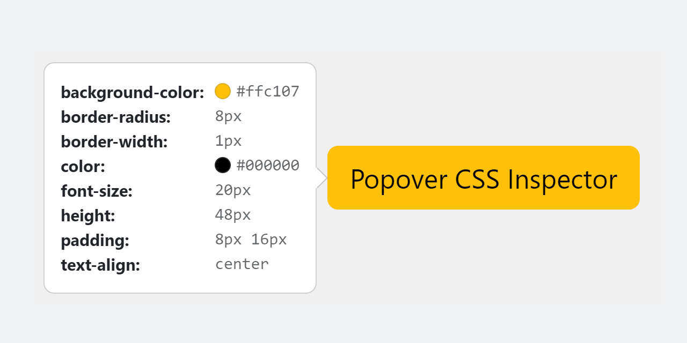

[](https://raw.githubusercontent.com/coliff/popover-css-inspector/main/LICENSE)
[](https://github.com/marketplace/actions/super-linter)
[](https://github.com/prettier/prettier)
[](https://www.npmjs.com/package/popover-css-inspector)
[](https://www.npmjs.com/package/popover-css-inspector)

# Popover CSS Inspector

Displays CSS attributes of elements in a Bootstrap popover. Ideal for design systems and style guides.

- Easy to use - just add `data-bs-custom-class="popover-css-inspector"` to the element (requires Bootstrap 5 JS)
- Customizable with your own CSS and Bootstrap's [Popover options](https://getbootstrap.com/docs/5.3/components/popovers/#options)
- Supports Bootstrap 5 dark mode
- Option to hide CSS elements - e.g. just add `data-css-inspector="hide-fs"` to prevent font-size properties from displaying
- Some CSS properties are hidden by default - e.g. just add `data-css-inspector="show-b` to show border properties
- Only 2 KB minified and gzipped!



## Quick start

Several quick start options are available:

- [Download the latest release](https://github.com/coliff/popover-css-inspector/releases/latest)
- Clone the repo `git clone https://github.com/coliff/popover-css-inspector.git`
- Install with [npm](https://www.npmjs.com/package/popover-css-inspector) `npm install popover-css-inspector`
- Install with [yarn](https://yarnpkg.com/en/package/popover-css-inspector) `yarn add popover-css-inspector`

## Usage

1. Add the `data-bs-custom-class="popover-css-inspector"` to the element you'd like to show the popover on. For example, a button.

```html
<button
  type="button"
  class="btn btn-secondary"
  data-bs-toggle="popover"
  data-bs-custom-class="popover-css-inspector">
  Button
</button>
```

2. Load the script (either async or defer is recommended):

```html
<script src="/js/popover-css-inspector.min.js" defer></script>
```

3. Some CSS properties are opt-in only. For example, to show border properties, add `data-css-inspector="show-b"` to the element.

4. All CSS properties can be hidden. For example, to hide font-size properties, add `data-css-inspector="hide-fs"` to the element.

## How it works

The script will look for any element with the `data-bs-custom-class="css-inspector"` attribute and add a click event listener to it. When clicked, it will get the element's CSS attributes and display them in a Bootstrap popover.

## Demo

[Demo page](https://coliff.github.io/popover-css-inspector/)

## Browser Support

Works well with all the browsers supported by [Bootstrap](https://getbootstrap.com/docs/5.3/getting-started/browsers-devices/#supported-browsers).

## Credits

Created by Christian Oliff with help from GitHub Copilot.
